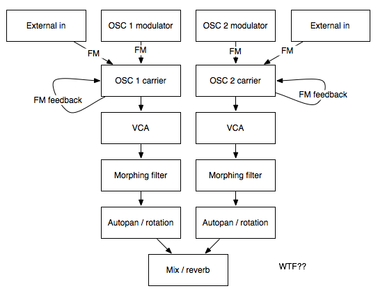

## Easter egg

**Ominous Voice**, a 2x2 operator FM synth voice.

> Think Braids' **FM/FBFM** times two. It lives in a strange middle-ground between classic subtractive analog and what you'd expect of FM.

#### How to activate it?

Set all the attenuverters and all the **TIMBRE** knobs of the Exciter section to their minimum position. Set all the attenuverters and the **DAMPING**, **POSITION**, and **SPACE** knobs of the Resonator section to their maximum position.

Hold the **PLAY** push-button for 5 seconds. Press **PLAY** again. The push-button's built-in LED should be off. You can now move the attenuverters and other knobs to their normal position.

#### How to get back to the normal modal synthesis firmware?

Same procedure as above.

#### How does it work?

The autopan / rotation is a quadrature LFO thingie that acts on both pan and a mild LPF - the result is an effect of source rotation / slow filter sweep / leslie / tremolo. The rotation rate for oscillator 1 and 2 is different, so there are interesting beating effects too.

#### Repurposed controls

**CONTOUR**: shape of the built-in envelope that is triggered by the PLAY button or the GATE input.

**BOW**: detuning of oscillator 2 with respect to oscillator 1. The range is -2 octaves to 2 octaves, with strategically placed notches.

**BLOW**: oscillator 1 level. May soft-clip past 12 o'clock.

**STRIKE**: oscillator 2 level. May soft-clip past 12 o'clock.

**FLOW**: oscillator 1 carrier/modulator frequency ratio. This control acts in similar fashion to the **COLOR** knob of Braids' FM models: it has virtual notches at interesting frequency ratios, such as those found on Yamaha's DX series synths. 12 o'clock gives a 1:1 frequency ratio.

**MALLET**: oscillator 2 carrier/modulator frequency ratio. Same scale as above.

**(BOW) TIMBRE**: oscillator 1 & 2 feedback amount. This increases the amount of phase feedback of both oscillators - progressively making them harsher and more chaotic (like morphing from Braids' FM to FBFM).

**(BLOW) TIMBRE**: oscillator 1 FM amount.

**(STRIKE) TIMBRE**: oscillator 2 FM amount.

Wow! You can also use the BLOW/STRIKE external inputs for audio-rate phase modulation of both oscillators.

**COARSE/FINE/FM**: coarse/fine frequency, and exponential FM of both oscillators 1 and 2.

**GEOMETRY**: response of the stereo filter. This interpolates between low-pass, notch, high-pass, and finally band-pass. The filter has a mild resonance. No dedicated resonance control because it's kind of silly on FM timbres.

**BRIGHTNESS**: cutoff frequency of the stereo filter.

**DAMPING**: amount of filter modulation from the internal envelope and the **STRENGTH** CV input.

**POSITION**: speed of the stereo rotation.

**SPACE**: mixing configuration. When set to its minimum value, OUT L contains the raw mix of both oscillators, and OUT R a mono signal without spatialization (but with the filter and VCA). When turning the knob further, you reach a zone where the stereo rotation becomes more intense. Past 12 o'clock, the reverb kicks in.