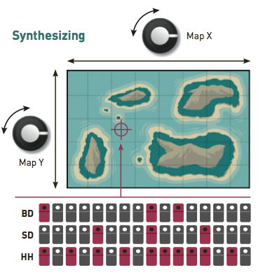
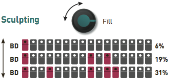
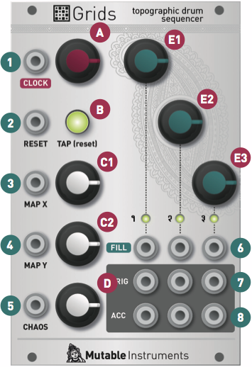
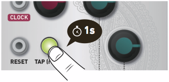

## Overview

Grids is a 3-channel trigger generator specialized in the creation and sculpting of rhythmic patterns.

At the core of Grids is a map, that has been obtained through machine learning techniques, of the drum patterns used in a large collection of electronic music tracks and drum loops. The skeleton and structure of the rhythm is programmed by selecting its X and Y coordinates on the map - with smooth interpolation/morphing between points.

Once this skeleton is in place, variations can be generated by controlling the "event density" of each of the three channels - gradually morphing from a sparse backbone to a frantic pattern. X / Y map position, and the density of the 3 channels are all CV-controllable, allowing rhythmic variations to be created by any modulation source. In contrast to Euclidean sequencers which are purely algorithmic, Grids' has "learned" patterns from actual data and with the right settings might generate a breakbeat or an influential Kraftwerkian beat.

Most patterns are best played with channel 1 = BD ; channel 2 = SD ; channel 3 = HH, but experimentation with other sound sources is of course encouraged.

Grids has a built-in clock, or it can accept external clock signals of variable resolution.

## Installation

Grids is designed for Eurorack synthesizer systems and occupies 16 HP of space. It requires a **-12V/+12V** supply (2x5 connector), consuming 1mA from the -12V rail and 25mA from the +12V rail. The red stripe of the ribbon cable must be oriented on the same side as the "Red stripe" marking on the printed circuit board.

## Grids' pattern generation algorithm

Grids is a 3-channel, algorithmic, rhythmic pattern generator based on data and models extracted from actual BD drum loops. Two steps are involved in the generation of the drum patterns:

### Step 1: Synthesizing a pattern from the drum map...

A collection of drum loops has been spatially organized and compressed into a 2-dimensional map. Using interpolation techniques, any pair of X/Y coordinates can be translated into a rhythm, with smooth morphing from one rhythm into the other.

### Step 2: ... and sculpting it!

Once a rhythmic skeleton is read from the map, variations can be generated by controlling the note density of each of the three channels - gradually morphing the pattern from a sparse backbone to a frantic pattern.

## Controls

**A: Internal clock rate**. Ranges from 40 BPM to 240 BPM. When turned fully counter-clockwise, the internal clock is disabled and the unit expects a clock signal on its CLOCK input.

**B: Tap (reset)**. This button acts as a tap tempo, and flashes on each beat. Tap it twice or more to set the tempo. The duration between the two most recent taps defines the duration of a beat. Once the tempo has been programmed with the tap tempo button, the CLOCK knob is locked and has no effect on the rhythm. Tap just once on the Tap button to unlock the CLOCK knob.

**C1, C2: Map coordinates**. These two knobs specify the region of the rhythm map from which is derived the structure / backbone of the rhythm.

**D: Chaos amount.** This button controls the amount of random perturbations applied to the three FILL parameters. When set to a high value, rolls/ghost notes will be randomly added to the pattern.

**E1, E2, E3: Fill rate**. These knobs indicate how dense the rhythmic pattern is for each of the three channels/instruments. Turn counter-clockwise to simplify the pattern (to the point of muting the channel entirely), turn clockwise to add notes (until the pattern is entirely filled). The position of the added/removed notes depends on the rhythmic backbone specified by the X and Y parameters.

## Inputs and outputs

**1. CLOCK**: External clock input. The external clock is ignored unless the **CLOCK** knob is set to its minimum value and tap tempo is reset. Recommended level : 0 to +5V, though higher voltages are accepted.

**2. RESET**: Pattern reset input. A raising edge on this input resets the rhythmic pattern to its first step. Recommended level : 0 to +5V, though higher voltages are accepted.

**3, 4, 5, 6. MAP X, MAP Y, CHAOS, FILL**: Control voltages added to the value of the eponymous knob. The minimum position of the knob corresponds to 0V, and its maximum position to 5V.

**7. TRIG**: Trigger outputs for each of the 3 channels. Triggers have a +5V level and a duration of 1ms.

**8. ACC**: Accent outputs for each of the 3 channels. The accent indicates the structurally important steps in the pattern, and can be fed straight into x0x style modules. They have a +5V level and a duration of 1ms.

## Options

Unplug all CV inputs and hold the **TAP/reset** button for half a second to adjust Grids' options. The switch stays illuminated. Hold the button again for half a second when you are done.

[Settings reference card (PDF download)](downloads/grids_settings_reference_card.pdf)

### Clock resolution.

Clock resolution is set by **E1**. The 3 LEDs indicate the current value of this setting (4, 8, and 24 ppqn respectively). Grids does not try to regenerate a high-resolution clock from a low-resolution clock (think of it as a form of quantization). Thus, using the 4ppqn clock might distort the patterns that use 32-th notes; and using 8ppqn or 4ppqn might distort the patterns that use triplets.

### Tap tempo vs reset.

The tap tempo / beat indicator button can be configured instead as a reset button / pattern start indicator. Turn **E2** to switch between these two modes:

-   LEDs off: Tap to reset to the beginning of the pattern
-   LEDs on: Tap to set the tempo

### Swing

Turn **E3** to enable or disable swing on the internal clock. When enabled, swing is controlled by the **CHAOS** randomization setting (which it replaces) - and affects the internal clock only. The LEDs indicate the status of the swing setting:

-   LEDs off: Swing is disabled. CHAOS works as a randomization control
-   LEDs on: Swing is enabled on the internal clock. CHAOS controls its amount

It is not possible to add swing to a clock signal received on the **CLOCK** input; and it is not possible to add swing in euclidean sequencer mode.

### Euclidean sequencer mode.

Why have less when you can have more? Grids can also work as a vanilla euclidean sequencer. Turn **C1 (MAP X)** to switch between the euclidean sequencer mode and grids' own flavor of pattern generation.

-   LEDs off: Grids is yet another euclidean sequencer
-   LEDs on: Grids is back to drumming duties

In euclidean sequencer mode, the **C1, C2** and **D** knobs control respectively the cycle length/size of the pattern on channels 1, 2, and 3; and the **E1, E2** and **E3** knobs control the fill rate. The **ACC** outputs will spit a trigger on the first note of the pattern - that is to say, whenever the pattern completes a cycle.

### Trig / Gate output.

By default, Grids produces trigger signals (short 1ms pulses). This behavior - which is recommended for 808 or 909-like sound modules - can be changed in order to produce gate signals more suitable for controlling envelopes or other modules' CV inputs. In this case, the output stays high for the whole duration of the clock's positive cycle. It is thus possible to alter the gate length by driving Grids from a clock module with a duty cycle parameter (or from a square VCO with pulse-width control). The internal clock has a fixed 50% duty cycle. To change the trig/gate configuration, turn **C2 (MAP Y)**.

-   LEDs off: Outputs are triggers.
-   LEDs on: Outputs are gates.

### Alternate output layout.

The row of 3 **ACCENT** outputs can be reconfigured to serve other purposes. The normal layout is: **ACC 1 / ACC 2 / ACC 3** But it can be reconfigured as: **ACC / CLK / RST** Where **ACC** is a global accent output, that is high whenever one of **ACC 1, ACC 2,** or **ACC 3** is high; **CLK** is a clock output (mirrors the clock input, or is the internal clock signal, whichever is in use); and **RST** is a reset trigger. To reconfigure the outputs and take advantage of the Clock / Reset outputs, turn the **D (CHAOS)** knob.

-   LEDs off: ACC 1 / ACC 2 / ACC 3
-   LEDs on: ACC / CLK / RST
