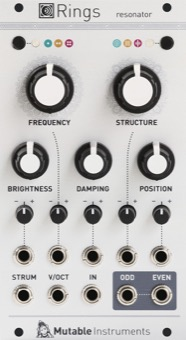

[TOC]

## Key data

*Resonator*

Parameter    | Value
-------------|------
Width        | 14HP
Depth        | 25mm
+12V current | 110mA
-12V current | 5mA
Lifetime     | 12/15 to 04/22
Modulargrid  | [Link](https://www.modulargrid.net/e/mutable-instruments-rings)
Processor    | STM32F405RGT6 @ 168 MHz
Codec        | WM8731

## Original printed manual

[PDF download](downloads/rings_quickstart.pdf)

## Features

### Three resonator models

* Modal resonator, as used in Elements.
* Sympathetic strings, modelled by a network of comb filters.
* String with non-linearity/dispersion (comb filter with multimode filter and non-linearities in the loop).

All resonator models can be used polyphonically, with 1, 2 or 4 polyphony voices.

### Voltage-controlled resonator

Each model provides a unified set of parameters, all voltage controlled, with an attenuverter:

* **Structure**. With the modal and non-linear string models, controls the inharmonicity of the spectrum (which directly impacts the perceived "material"). With the sympathetic strings model, controls the intervals between strings.
* **Brightness**. Specifies the brightness and richness of the spectrum.
* **Damping**. Controls the damping rate of the sound, from 100ms to 10s.
* **Position**. Specifies at which point the structure is excited.

### Easy to patch

* Audio input accepting modular level signals, up to 16 Vpp.
* Two audio outputs, either splitting odd/even partials in monophonic mode, or even/odd notes in polyphonic mode.
* Voltage change detector on the V/O input, allocating a new polyphony voice each time a different note is played.
* Internal exciter triggered by the **STRUM** input (filtered pulse or noise burst), allowing the module to be used without an external excitation source.

### Specifications

* Trigger input: 100k impedance, 0.6V threshold.
* CV inputs: 100k impedance, +/- 8V, 12-bit 2kHz.
* Audio I/O: 16-bit, 48kHz.
* Internal processing: 32-bit floating point.

## Design philosophy notes: Rings vs Elements

Elements = Exciter + Resonator + Reverb.

Rings = just the resonator.

Rings uses the same resonator code as Elements, with two additions:

* The ability to split the 60 filters into 2x30 or 4x15 to do polyphony.
* Two other string synthesis models which are not based on band-pass filters, but on comb filters - and which sound totally different from what Elements is doing.

All this is possible on Rings because 40% of the CPU is freed by the lack of exciter or reverb. This means that Rings will rely on external modules if you really want a large sound palette. For example, if you want to generate bowed string sounds, or blown tube sounds, you’ll need an external VCA, envelope generator, and colored noise source and patch them into Rings - while Elements has all the tools onboard to do this. Elements also benefits from the coupling of the exciter and resonator parameters - some knobs in Elements achieve their effect by controlling at the same time parameters of the exciter, of the resonator, and the mixing of the raw exciter and resonator signal.

So let’s take a comparison you might understand better: Elements would be a complex oscillator + filter, tuned to work very well with each other. Rings would be a multimode filter - it does more but in a narrower domain and your success rate depends on what you decide to throw at it.

During the design of Elements I thought a lot about breaking it into two modules (exciter and resonator), but I did not do it. The reason was that while the resonator would have worked great with other existing modules, the exciter module itself would have been quite useless since the only proper resonator available would have been its counterpart.

Also, Elements implements some coupling between the two (the BOW section of Elements is a combination of a specific excitation signal and a feedback path in the resonator; the BLOW knob acts on both the excitation signal and the level of a secondary resonator that runs in parallel to the modal one).

My favorite choice of exciters for Rings: field recordings from a Radio Music, Ears, Plaits, Beads with a noisy thing in its buffer.
