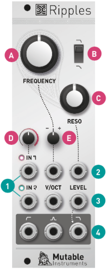

## Overview

Ripples is a voltage-controlled multimode filter. It provides 3 output modes: high-pass, band-pass and low-pass. Additionally, the slope (2-pole or 4-pole) of the band-pass and low-pass outputs is switchable.

The filtering is achieved by a high-quality quad VCA. An OTA in the filter feedback path brings the resonance under voltage control, and also serves as a soft-limiter to ensure a clean self oscillation.

Finally, a VCA allows the level of the low-pass output to be modulated by a CV. This makes Ripples a good "final stage" module for a subtractive synthesis patch.

The tonal character of the filter is inspired by Japanese classics from the 80s.

## Installation

Ripples requires a **-12V/+12V** power supply (2x5 pin connector). The red stripe of the ribbon cable (-12V side) must be oriented on the same side as the “Red stripe” marking on the module and on your power distribution board.
The module draws **35mA** from both the **+12V** and **-12V** supply rails.

## Controls

**A. Cutoff frequency**. From 20Hz to 20kHz.

**B. Filter slope**. The lower position corresponds to a 12 dB/octave slope (2-pole), the upper position to a rounder 24 dB/octave (4-pole). The BP and LP outputs are affected.

**C. Resonance**. Self-oscillation occurs at about 75% of the course of this potentiometer.

**D. Input 1 level**. The gain ranges between 0 and 5. With a high gain, a modular-level signal will soft-clip, resulting in an "overdriven" sound.

**E. Frequency modulation attenuverter**. Adjusts the amount and polarity of frequency modulation from the corresponding CV input.

## Inputs and outputs

**1. Audio inputs**: Input 1 goes through a soft-clipping circuit, while input 2 is always clean and matches the tonal character of Ripples mkI. The signals from both input circuits are mixed together.

**2. CV inputs** for cutoff modulation, resonance and cutoff modulation with V/Oct tracking.

**3. Voltage controlled gain** for the LP output. This voltage controls the level of the signal produced at the LP output. 0V silences the signal; 5V applies a unitary gain. Values above +5V are progressively compressed. A 7V signal is applied to this input if no patch cable is inserted.

**4. Outputs**: High-pass, band-pass, and low-pass outputs. The slope of the HP output varies with resonance, while the slope of the BP and LP output is adjusted with the **[B]** switch.

## Calibration procedure

1.  Set the FREQ knob to 10 o'clock (exact position does not matter).
2.  Set the RES knob to its maximum position. Disconnect any input signal or FM modulation CV.
3.  Connect the note CV output of a well-calibrated keyboard interface or MIDI-CV converter to the V/OCT input.
4.  Listen to the tone at the low-pass output.
5.  Adjust the trimmer resistor on the side of the circuit board until the musical intervals played on the keyboard are correctly reproduced (actual note values do not matter, but when playing an octave, it must sound like an octave).

The filter is designed to track well over 4 octaves, but is not temperature-stabilized.
