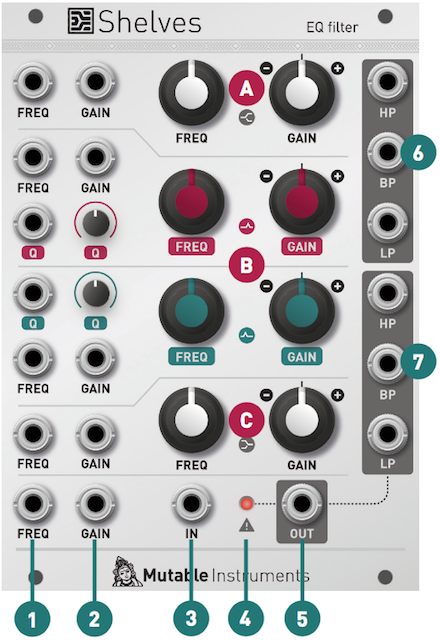
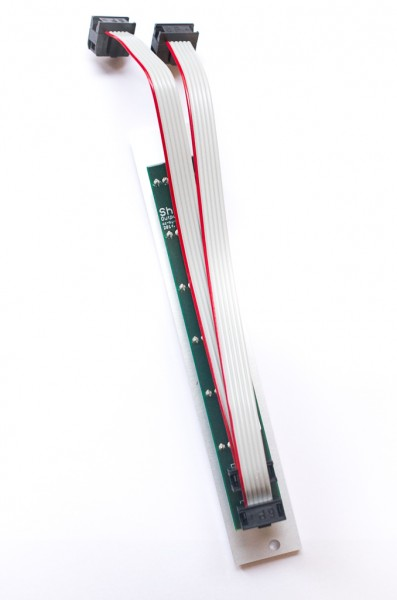
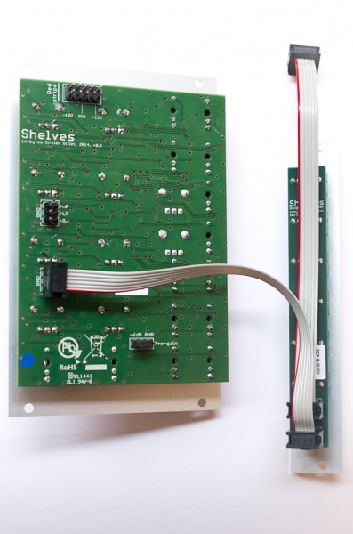
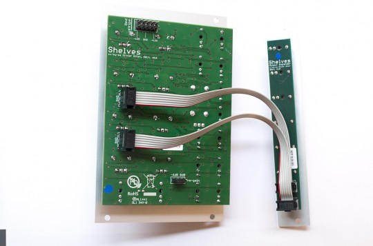

## Overview

Shelves is a voltage-controlled signal processor inspired by the EQ section of console channel strips. Just like many sought-after equalizers, it provides low-shelf, high-shelf, and two parametric tone controls. Unlike an equalizer, each of these four tone controllers can be swept over the entire audio range; and their parameters can be freely modulated with control voltages.

Shelves occupies a space between tone-controllers and filters, sometimes achieving sounds reminiscent of a filter bank. It provides a subtler and less cliché'd way of spectrally altering complex drones or feedback patches.

## Installation

Shelves is designed for Eurorack synthesizer systems and occupies 16 HP of space. It requires a **-12V/+12V** supply (2x5 connector), consuming 75mA from the -12V rail and 75mA from the +12V rail. The red stripe of the ribbon cable must be oriented on the same side as the "Red stripe" marking on the printed circuit board.

## Controls, inputs and outputs

**A. High-shelf section.** This section boosts or attenuates all frequencies above the **FREQ** control. The **GAIN** potentiometer controls the amount of attenuation or boosting. No modification is applied when **GAIN** is in its central position.

**B. Parametric sections 1&2.** These two sections boost or attenuate all frequencies in a frequency band whose central frequency is set by **FREQ**. The narrowness of this frequency band is set by the **Q** setting - from very wide to very selective.

**C. Low-shelf section.** This section boosts or attenuates all frequencies below the **FREQ** control. The **GAIN** potentiometer controls the amount of attenuation or boosting. No modification is applied when **GAIN** is in its central position.

**1. 2. Global frequency and gain CV inputs.** These CV inputs simultaneously adjust the **FREQ** or **GAIN** of all 4 channels.

**3. IN**. Audio input. The input signal can optionally be attenuated by -6dB before being processed by the EQ filter. A jumper is available on the back of the module to enabled/disable this pre-gain.

**4. Output clipping indicator.** It is recommended to reduce the level of the input signal - or to reduce the gain on all channels - when this LED lights up.

**5. OUT**. Audio output.

**6. 7. Individual outputs** for the parametric sections' filters. Behind the scenes, Shelves' parametric sections are full-blown multimode filters. The low-pass (LP), band-pass (BP), and high-pass (HP) outputs of these two filters are provided on these two groups of jacks.

**Note: the first batch of modules had these two groups of three outputs on a separate expansion module. Please refer to the last section to learn how to connect it to the main board.**

## Ranges and scales

On all sections, the **FREQ knob** spans the entire audio range, from 20 Hz to 20 kHz.

The **FREQ CV input** has a 1V/Oct scale and acts as an offset to the value set by the **FREQ knob**.

The **GAIN knob** covers an attenuation/boost range of -15dB to +15dB.

The **GAIN CV** input has a 3dB/V scale and acts as an offset to the value set by the GAIN knob.

Gains above +15dB cannot be reached, even by adding a positive CV offset to the **GAIN CV input**. However, gains below -15dB can be obtained by adding a negative CV offset to this CV input.

On the two parametric sections, the **Q** parameter, which controls filter selectivity, goes from 1 to 10, but can reach much higher values with CV modulation.

## Expander

The first batch of modules had the two groups of HP/BP/LP outputs on a separate expansion module. The expander is provided with two cables. Check that they are connected like on these pictures (observe the orientation of the red stripe):

