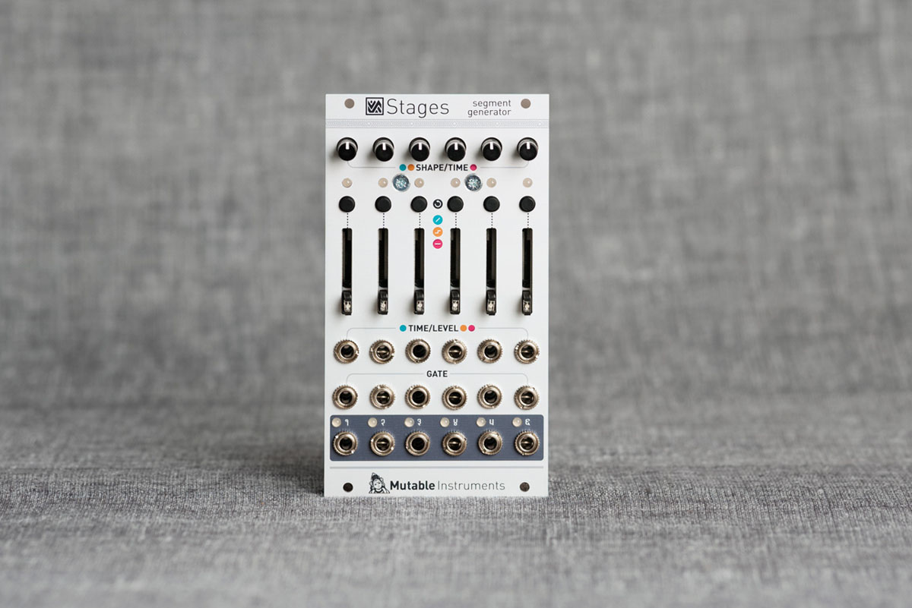
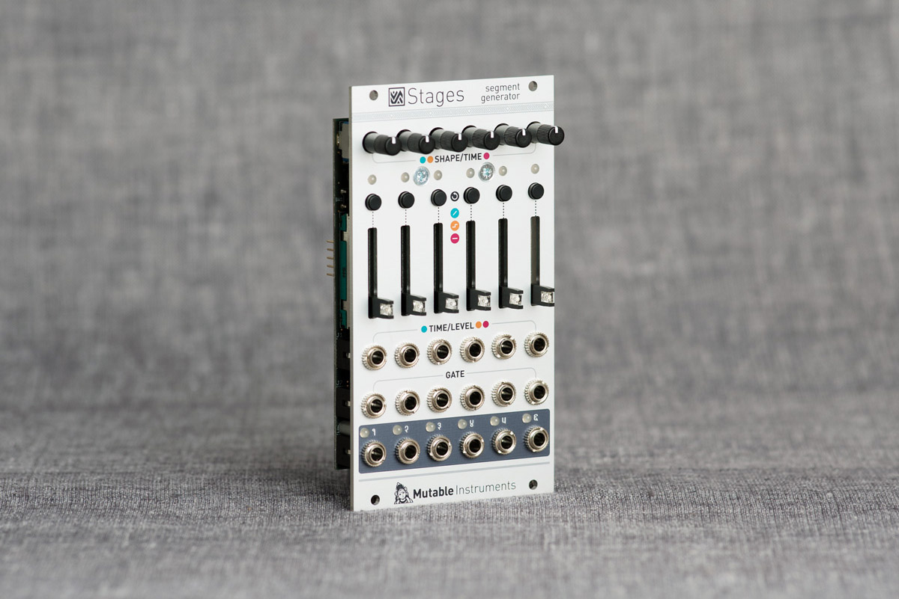

## The modulation construction set

ASR envelope, complex 6-stage envelope, LFO, 4-step sequence or switched LFO: Stages can be **any kind of modulation**.

Not because all these behaviors have been pre-programmed in the module, but because it allows you to **describe your own modulations in terms of basic operations**: ramp from one voltage to another, hold a voltage at a set level, wait for a trigger and slew. With or without looping.

Whether you need one complex envelope, or several simpler modulations, Stages reconfigures itself according to which of its gate inputs are patched. There is always a role for it in your patch.

## That's it

Really, there isn't more to the story.

Self-generating chiptunes? Very weird LFO shapes? Random gate delay? Stages probably does strange and wonderful things when patched in a certain way.

