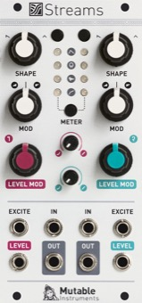

[TOC]

## Key data

*Dual dynamics gate*

Parameter    | Value
-------------|------
Width        | 12HP
Depth        | 25mm
+12V current | 100mA
-12V current | 30mA
Lifetime     | 01/15 to 04/21
Modulargrid  | [Link](https://www.modulargrid.net/e/mutable-instruments-streams)
Processor    | STM32F103CBT6 @ 72 MHz
DAC          | DAC8552 (for internal CVs only)

## Original printed manual

[PDF download](downloads/streams_quickstart.pdf)

## Features

### Four dynamics manipulation functions

#### Envelope generator

The **EXCITE** input can work as a trigger input, triggering an internal AD or AR envelope routed to the gain and the filter cutoff (in variable amount). With only 6-HP of space, you can shape an oscillator or noise source into a full-bodied sound.

#### Vactrol curve generator

The **EXCITE** input is processed by a digital model of a resistive opto-isolator (Vactrol), controlling the gain and the filter cutoff (in variable amount).

The digital emulation allows the modification of properties of opto-isolators – such as response time – which are otherwise difficult to control.

The virtual vactrol response can be either optimized for processing CVs, or triggers (for "plucked" sounds).

#### Amplitude and frequency content follower

The envelope and cutoff of the **EXCITE** signal is measured, and applied to the signal on the VCFA input.

#### Compressor/limiter

Streams' VCF is disabled, and the VCA is used to control the dynamics of the input signal.

An intuitive control scheme allows the compressor to be used either for peak reduction/limiting operation; or for boosting signal levels with soft-limiting. The **EXCITE** input can be used as a sidechain.

### Specifications

* Analog signal path.
* All inputs DC-coupled.
* 12-bit, 31kHz EXCITE signal acquisition (for metering and following).
* 16-bit, 31kHz control voltage generation.

### Signal flow

