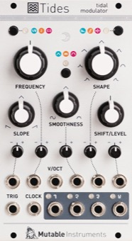

[TOC]

## Key data

*Tidal modulator*

Parameter    | Value
-------------|------
Width        | 14HP
Depth        | 25mm
+12V current | 50mA
-12V current | 20mA
Lifetime     | 09/18 to 06/22
Modulargrid  | [Link](https://www.modulargrid.net/e/mutable-instruments-tides)
Processor    | STM32F373CCT6 @ 72 MHz
DAC          | DAC8164

## Original printed manual

[PDF download](downloads/tides_quickstart.pdf)

## Features

### Digital function generator

* 3 operating mode: AD envelope, looping (VC-LFO/VCDO), AR envelope.
* 3 frequency ranges for the main frequency knob: low (2 minutes to 2 Hz), medium (0.125 Hz to 32 Hz), high (8 Hz to 2kHz). This range can be widened by applying an offset on the **V/OCT** input.

### A large palette of waveforms

* Shape control with CV input – covering various combinations of linear, exponential, or sinusoidal segments.
* Slope/asymmetry (A/D time ratio) control with CV input.
* Smoothness control with CV input: smoothes the waveform using a 2-pole digital filter, or adds bumps and kinks with a digital wavefolder.

### External clocking/PLL

* The module can use an external clock or clean audio signal as a reference, and operate at a multiple of this clock (from 1/16 to 16x).
* This allows, for example, the generation of (sub)harmonics from another VCO.

### 4 output modes

* **Different shapes**. Each output produces a different waveshape: main signal (with voltage-controlled attenuverter), raw asymmetric triangle, end of attack gate, end of release gate.
* **Different amplitudes**: Voltage-controlled dispatching of the signal to each of the 4 outputs.
* **Different times**: Voltage-controlled phase or apex shifting of the signal.
* **Different frequencies**: Outputs 2, 3, and 4 are shifted up or down in frequency relatively to output 1, creating chords or polyrhythmic LFOs.

### Specifications

* All inputs: 100k impedance, DC to 7.8kHz.
* **SLOPE**, **SMOOTHNESS**, **SHAPE**, **SHIFT/LEVEL** input range: +/- 8V.
* **V/OCT** input range: -3 to +7V.
* **TRIG** and **CLOCK** input range: 0 to +8V, protected.
* 16-bit CV capture.
* Internal processing: 32-bit floating point.
* CV Outputs: 14-bit, 62.5kHz (31.25kHz in **different frequencies** mode).
* Output levels: bipolar +/- 5V for cyclic signals; unipolar +8V for gates and envelopes.
