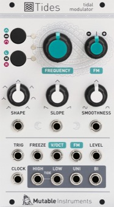

[TOC]

## Key data

*Tidal modulator*

Parameter    | Value
-------------|------
Width        | 14HP
Depth        | 25mm
+12V current | 55mA
-12V current | 5mA
Lifetime     | 03/14 to 04/18
Modulargrid  | [Link](https://www.modulargrid.net/e/mutable-instruments-tides-2014-version)
Processor    | STM32F103CBT6 @ 72 MHz
DAC          | DAC8552

## Original printed manual

[PDF download](downloads/tides1_quickstart.pdf)

## Features

### Digital function generator

* 3 operating mode: single shot (attack/decay), sustained (attack/sustain/release), looping (VC-LFO/VCDO).
* 3 frequency ranges: low (20 minutes to 5 Hz), medium (0.05 Hz to 300 Hz), high (8 Hz to 10kHz).
* Freeze gate input to stop the oscillator and hold its output.

### A large palette of waveforms

* Shape control with CV input – covering various combinations of linear, exponential, or sinusoidal segments.
* Slope/asymmetry (A/D time ratio) control with CV input.
* Smoothness control with CV input. From 0V to -5V, smoothes the waveform using a 2-pole digital filter, from 0V to +5V, adds bumps and kinks with a digital wavefolder.

### Advanced features

* Output level CV input (digital VCA).
* Dual outputs: standard unipolar waveform, and "double-shot" waveform with a positive spike during the ascent and a negative spike during the descent. At audio rate, both of them have a different sound.
* Accurate V/Oct tracking with straightforward calibration procedure.
* Clock input to lock onto a multiple or fraction of a trigger sequence, or to generate harmonies directly from an audio signal (PLL mode).

### Specifications

* All inputs: 100k impedance.
* CV inputs: 12-bit, 1kHz for shape/slope/smoothness, 12-bit to 6kHz for FM, 12-bit 48kHz for amplitude.
* CV Outputs: 16-bit, 48kHz.
* Output levels: +/- 5V for the *BI* output, 0V to +8V for the other outputs.

## Revisions and variants

An initial batch of 250 units was made by a dubious CM in the US, only a small fraction of which has been sold. The next batches were made in France at the end of 2014.

### 2014

First batch made in France, labelled "v0.3":

* Green PCB (originally black).

### 2015

Hardware revision labelled "v4" with the following differences:

* Thonkiconn jacks.
