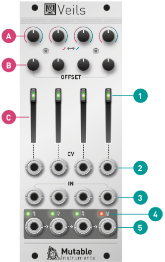

## Installation

Veils requires a **-12V/+12V** power supply (2x5 pin connector). The red stripe of the ribbon cable (-12V side) must be oriented on the same side as the "Red stripe" marking on the board. The module draws 50mA from the -12V rail and 50mA from the +12V rail. Current consumption can reach 70mA on either rail depending on the color and brightness of the LEDs.

## Overview

Veils provides four VCAs with an adjustable response curve and an offset control. Their outputs are daisy-chained, allowing adjacent groups of 2, 3, or all 4 channels, to be mixed together.

## Controls, inputs and outputs



**A. Response curve.** Continuously variable between exponential and linear. Because the exponential function grows rapidly, very high gains (above 100) can be achieved with an exponential response curve combined with a large positive offset. Beware of clipping!

**B. Offset control.** This control adds a positive offset to the CV signal, for example to obtain a unipolar modulation from a bipolar LFO.

**C. Gain CV amount.** Amount of gain (amplitude) modulation from the CV input 24), or direct gain control when no cable is patched in the CV input. When set to the maximum, a CV of +5V yields a gain of 1 (0dB), and a CV above +5V might cause distortion.

**1. Gain indicator LED.** Its brightness is proportional to the VCA gain, on a dB scale. The LED is off when the signal is muted.

**2. Gain CV input.** Normalized to a constant +8V.

**3. DC-coupled signal input.** Accepts audio or CV signals.

**4. Output indicator LED.** Its brightness represents signal level, and its color represents signal polarity (green = positive).

**5. Signal output.** When no patch cable is plugged into an output, the signal from this channel is routed to the next channel. For example, when no patch cable is patched into output 1, output 2 will contain the sum of channel 2 and channel 1. If nothing is patched into outputs 1, 2 and 3, output 4 will contain the sum of all four channels.

## Offset?

The offset control on Veils offsets the CV, not the output or input signal. In other words, it offsets the *modulation* applied to the main signal.

In mathematical terms, the output of the module is ```(CV x cv_amount + offset) x input_signal```.

You can use this feature, for example, to add an offset to the LFO that will modulate, within Veils, the amplitude of a signal (let's say the tone generated by an oscillator). You cannot use this feature to take a bipolar LFO and get on the output a unipolar version of it.

However, a possible workaround is to send a constant +5V signal to the signal input (**3**), and then send your modulation to the CV input (**2**). With this patch:

* The main slider (**C**) scales the modulation signal.
* The offset potentiometer (**B**) adds a positive offset.
* The response curve potentiometer (**A**) controls the shape of the modulation, from squashed/peaky to normal.
* The resulting signal is half-wave rectified.

The following [graph](https://www.desmos.com/calculator/hfy87xjw7u) shows how the module reacts to a +/- 5V bipolar LFO patched into the CV input, with a constant +5V patched into the main signal input.