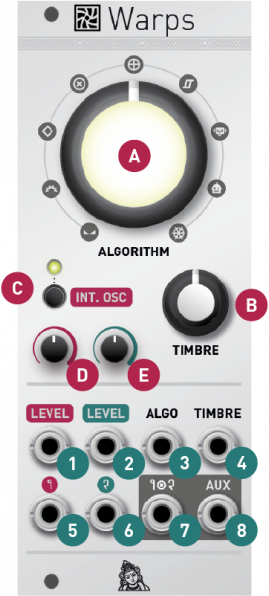
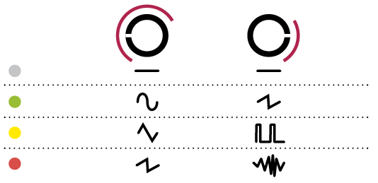

## Overview

Evolved from the oscillator mixing section of Mutable Instruments' desktop hybrid synths, Warps is designed to blend and combine two audio signals. A variety of cross-modulation methods - some of them emulating classic analog circuits, some of them purely digital - are provided by the module. With Warps, the cross-modulated sound can be sculpted with control voltages along 4 dimensions: by controlling the amplitude and distorting the input signals, by smoothly scanning through the collection of modulation algorithms, and by adjusting a timbre parameter controlling the brightness/harshness of the modulated signal.

Most cross-modulation algorithms provided in Warps make the distinction between a *carrier* signal and a *modulator* signal: the carrier signal will be filtered or modulated to acquire some of the characteristics of the modulator signal. However, some other algorithms emulate symmetrical circuits and do not make such a distinction (the underlying mathematical operation is commutative).

Since many classic cross-modulation effects work best when the carrier is a simple waveform - for example, a sine wave for ring-modulation or a buzzing waveform simulating glottal pulses for vocoding - Warps includes a digital oscillator offering a handful of classic waveforms. This internal oscillator tracks V/Oct and will replace the carrier audio input - freeing up one oscillator in your system for other duties!

## Installation

Warps is designed for Eurorack synthesizer systems and occupies 10 HP of space. It requires a **-12V/+12V** supply (2x5 connector), consuming 5mA from the -12V rail and 110mA from the +12V rail. The red stripe of the ribbon cable must be oriented on the same side as the "Red stripe" marking on the printed circuit board.

## Controls, inputs and outputs

**A. Modulation algorithm.** This knob selects which signal processing operation is performed on the carrier and modulator. The algorithms are described in further details in the next section.

**B. Modulation timbre.** This knob controls the intensity of the high harmonics created by cross-modulation - or provides another dimension of tone control for some algorithms.

**C. Internal oscillator state.** This button enables the internal oscillator and selects its waveform. The color of the LED depends on the oscillator waveform - when the LED is off, the internal oscillator is disabled and an external signal is used as a carrier.

**D. External carrier amplitude or internal oscillator frequency.** When an external carrier is used (that is to say, when the internal oscillator is switched off), this knob controls the amplitude of the carrier, or the amount of amplitude modulation from the channel 1 **LEVEL** CV input. When the internal oscillator is active, this knob controls its frequency.

**E. Modulator amplitude.** This knob controls the amplitude of the modulator, or the amount of amplitude modulation from the channel 2 **LEVEL** CV input. Note that gains above 1.0 can be applied, for a warm overdrive effect!

**1. External carrier amplitude or internal oscillator frequency CV input.** When the internal oscillator is switched off, this CV input controls the gain of the carrier input. When the internal oscillator is enabled, it acts instead as a V/Oct control for the oscillator frequency.

**2. Modulator amplitude CV input.** This CV input controls the gain of the modulator input. Just like its carrier counterpart, it is internally normalized to a constant +5V source when no patch cable is plugged in. When a signal is patched into this input, the amount of CV modulation is controlled by the Modulator amplitude knob (E).

**3. Algorithm CV input.** The CV on this input is added to the position of the Modulation algorithm knob (A).

**4. Timbre CV input.** The CV on this input is added to the position of the Modulation timbre knob (B).

**5. 6. Carrier (1) and modulator (2) audio inputs.** Warps expects modular-level signals (typically 10Vpp, up to 20Vpp).

**7. Modulator output (1x2).** This is the main audio output.

**8. Auxiliary output.** This output carries, when the internal oscillator is disabled, the sum of the carrier and the modulator, post VCA. Otherwise, it carries the raw waveform from the internal oscillator.

## Modulation algorithms

The carrier and modulator are crossfaded into each other, using a constant-power law. **TIMBRE** controls the crossfading position - both signals are equally mixed at 12 o'clock.

The carrier and modulator are summed, a tiny bit of cross-modulation product is added to spice things up, and the resulting signal is sent to a wavefolder the amount of which is controlled by **TIMBRE**.

The carrier and modulator are crudely multiplied, using a digital model of a diode ring-modulator. **TIMBRE** post-processes the resulting signal with a variable amount of gain (and emulated diode clipping).

A gentler version of the previous algorithm which uses a proper multiplication operation in the digital domain, which will sound more similar to all the AD633-based analog ring-modulators out there! **TIMBRE** post-processes the signal with a gain boost and soft-clipping.

Both carrier and modulator are converted to 16-bit integers, and the two resulting numbers are XOR'ed bit by bit. **TIMBRE** controls which bits are XOR'ed together.

A handful of signals are synthesized through comparison operations ("replace the negative portion of the carrier's signal by the modulator", "if the absolute value of the carrier is greater than the absolute value of the modulator, output the modulator else the carrier"...). **TIMBRE** morphs through these signals (some of which having an octave pedal flavor).

A classic implementation of an analog vocoder, with a bank of 20 analysis and 20 synthesis third-octave 48dB filters. The modulator sub-band signals are processed by envelope followers from which are derived the gains of each of the carrier sub-band signals. **TIMBRE** warps the connections between the modulator's envelope followers and the carrier's gain elements - effectively shifting up or down the formants extracted from the modulator signal.

As the **ALGORITHM** knob is turned clockwise, the release time of the envelope followers is increased.

By turning the knob fully clockwise, the modulator signal is frozen. The carrier is filtered by whichever formants were present in the modulator signal before the knob reached this position.

## Internal oscillator

Press the **INT. OSC** button **\(C)** to enable the internal oscillator or select its waveform. Because cross-modulation algorithms work best with harmonically simple signals, while vocoders work better with harmonically rich signals, the available waveforms are different: sine, triangle and sawtooth for the former, and sawtooth, pulse and low-pass filtered noise for the later.

Some of the inputs, outputs or controls operate differently when the internal oscillator is enabled:

-   The **LEVEL** knob **(D)** and CV input **(1)** control the internal oscillator frequency.
-   The **Carrier audio input (5)** phase-modulates the internal oscillator, or feeds an external source of noise into the low-pass filter.
-   The **AUX** output **(8)** contains the signal generated by the internal oscillator.

* * *

## Advanced topics

### Calibration procedure

To calibrate the unit:

1.  Disconnect all CV inputs.
2.  Hold the **INT. OSC** button for five seconds until the **ALGORITHM** knob blinks in turquoise and the oscillator state LED blinks in yellow.
3.  Connect a patch cable to the **LEVEL 2** CV input. Leave the other end of the cable unplugged.
4.  Connect the CV output of a well-calibrated keyboard interface or MIDI-CV converter to the **LEVEL 1** CV input.
5.  Play a C2 note, or send a 1V voltage from your CV source.
6.  Press the **INT. OSC** button. The **ALGORITHM** knob blinks in fuchsia.
7.  Play a C4 note, or send a 3V voltage from your CV source.
8.  Press the **INT. OSC** button.
9.  Calibration is done!

###  Firmware update procedure

Unplug all CV inputs/outputs from the module. Connect the output of your audio interface/sound card to the **Carrier audio input (5)** input. Power on your modular system with the **INT. OSC \(C)** push-button pressed. The **INT. OSC** LED will blink in orange.

Make sure that no additional sound (such as email notification sounds, background music etc.) from your computer will be played during the procedure. Make sure that your speakers/monitors are not connected to your audio interface - the noises emitted during the procedure are aggressive and can harm your hearing. On non-studio audio equipment (for example the line output from a desktop computer), you might have to turn up the gain to the maximum.

When you are all set, play the firmware update file into the module. While the module receives data, the color of the **ALGORITHM** knob will reflect signal level - green or yellow is fine, red is too high! You can use the **Carrier amplitude** (D) knob to adjust the input gain.

In case the signal level is inadequate, the LEDs will blink in red. Press the **INT. OSC** button and retry with a correct gain. If this does not help, please retry the procedure from another computer/audio interface, and make sure that no piece of equipment (equalizer, FX processor) is inserted in the signal chain.

* * *

## Common issues

### The sound is choppy

It is intermittently interrupted by what sounds like morse code.

Recalibrate the normalization detector with the following procedure:

1. Connect a constant positive voltage source (for example an ON gate signal, or the output of an offset module, or the CV from a CV/Gate interface when you play the highest note on a keyboard) to the first **LEVEL** CV input, and leave all the other jacks of the module disconnected.
2. Hold the **INT. OSC** button for 10 seconds until both the **INT OSC** and the big knob LEDs blink in red.
3. Disconnect all patch cables from the module.
4. Press the **INT. OSC** button. The LEDs will blink in green now. Wait for a couple of seconds.
5. Press the **INT. OSC** button again.
