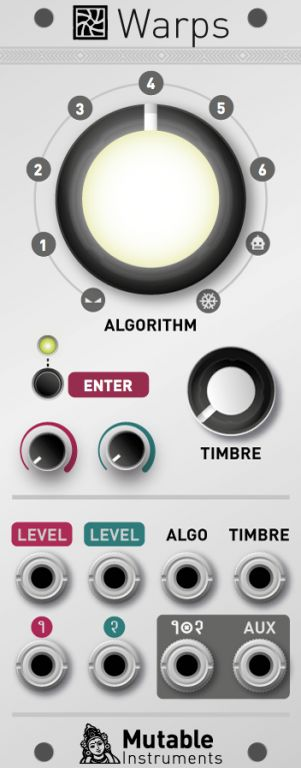

## Easter egg

To access the easter egg, a number sequence must be "dialed" on the module.

* Remove all patch cables.
* Put the timbre and the two level knobs fully counter clockwise.
* "Dial" the following number sequence: 2 4 3 6 1 5 by referring to the following image. You need to press the button after having dialed each number.

### Frequency shifter.

With **INT. OSC** enabled, the module works as a frequency shifter.

The **ALGORITHM** knob and **ALGO** CV input change the amount of frequency shifting. No shifting at 12 o'clock, positive frequencies when turning CW, negative frequencies when turning CCW. The control curve is linear until 50 Hz then becomes exponential. The response of the **ALGO** CV input (which modulates shifting amount) depends on the position of the big knob - it is linear when the big knob is near its central position, and 1V/Octave-ish when the big knob is above 50 Hz or below -50Hz.

The **INT. OSC** button selects the carrier waveform. The available waveforms are sine, three harmonics, and a "random" signal created by summing 7 harmonics with random amplitudes/phases. With a low frequency shifting amount, you can think of this as the tremolo/delay/phasing modulation waveform. Another way to think about this parameter is that there will be one shifted "copy" of the input signal per harmonic of the carrier waveform.

**LEVEL 1** CV/knob: feedback amount.

**LEVEL 2** CV/knob: dry/wet amount.

**TIMBRE**: balance between the lower and upper sidebands. Both sidebands are present (ring-modulation) when the knob is at 12 o'clock.

**AUDIO IN 1 & 2**: two audio inputs, summed together, and processed by the frequency shifter.

**AUDIO OUT 1+2 / AUX**: the two audio outputs react reversely to the TIMBRE knob. For example, if **TIMBRE** is fully CCW, 1+2 will output the lower sideband, and **AUX** will output the upper sideband. Great for generating a wide stereo image!

### Quadrature cross-modulator

When **INT. OSC** is disabled, the module becomes a kind of "quadrature cross-modulator".

Mathematically, it computes the product of the analytic signals obtained from inputs 1 and 2, and another complex exponential - then the real and imaginary parts of the result are dispatched to the two outputs.

You can think of it as frequency shifting, except that instead of dialing the shifting frequency with the big knob, you directly feed a sinewave at this frequency on input 1 to shift input 2. Obviously, feeding a waveform more complex than a sinewave on input 1 will cause multiple shifts of the signal on input 2 - creating very complex inharmonic tones!

**ALGORITHM** will control the amount of phase shifting on the result of the modulation. You won't hear much difference when you move it very slowly - the magic happens when it is modulated with the CV input.
