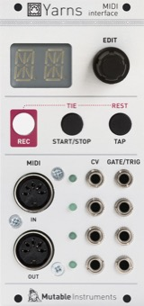

[TOC]

## Key data

*4-channel MIDI interface* (*MIDI interface* on the packaging)

Parameter    | Value
-------------|------
Width        | 12HP
Depth        | 25mm
+12V current | 60mA
-12V current | 2mA
Lifetime     | 03/14 to 10/20
Modulargrid  | [Link](https://www.modulargrid.net/e/mutable-instruments-yarns)
Processor    | STM32F103CBT6 @ 72 MHz
DAC          | DAC8564 (for internal CVs only)

## Original printed manual

[PDF download](downloads/yarns_quickstart.pdf)

## Features

### Conversion modes

* Monophonic with note, velocity, modulation wheel, auxiliary CC/aftertouch CV.
* 2-voice polyphonic or 2-part multitimbral with two note CV and auxiliary CC/aftertouch CV.
* 4-voice polyphonic or 4-part multitimbral with four note CV.
* 4-part trigger conversion with MIDI note selection for each part.
* Clock/reset output in monophonic, duophonic, or trigger conversion modes.
* Polychaining mode handling half of the notes internally and forwarding the other half to the MIDI out.

### MIDI processing

* Transposition.
* Split/keyboard ranges.
* Multiple voice allocation schemes in polyphonic mode (voice-stealing, random, cyclic).
* Multiple note priority modes in monophonic mode (lowest, highest, latest).
* Arpeggiator with up/down/up&down/random/chord/"as played" modes and 22 preset patterns.
* 64-note SH-101 style sequencer per part.
* Euclidean pattern generator.

### CV/Gate conversion

* 1 V/oct and 5V Gate/Trigger standard.
* Micro-tunings (programmed through MIDI tuning messages).
* Portamento, pitch-bend and modulation wheel (vibrato).
* Audio output mode replacing the note CV by a digital oscillator offering sine, square, pulse, triangle, sawtooth or noise waveforms.

### Specifications

* 8kHz CV refresh rate, 48kHz refresh rate in audio mode.
* High-end 16-bit DAC and voltage references.
* 12-point calibration table, adjusted in factory.
* 8 memory slots for storing/recalling all settings and sequences.
* Cortex-M3 ARM processor guaranteeing blazingly fast response to MIDI messages (125µs latency).
