**May 30th 2017**

I pitch "Clouds light" to Hannes, with this mockup.

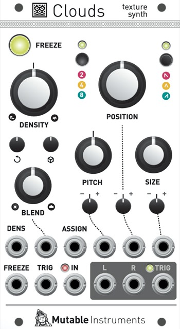

Yes, it was supposed to have a mono in, and a dedicated grain trigger output. Preset envelope shapes. Buffer duration indicated by a number. Dedicated CV input for dry/wet mixing. ASSIGN could be assigned to envelope shape, feedback, reverb, or override the random signals routed to the attenuverters. Yes, the attenuverters were still attenuverters.

**June 7th 2017**

Hannes comes up with mockups that fail to convince me. There must have been 25 of them in total.

**June 15th 2017**

The first time the internal wavetable mode is discussed, after Hannes asks me if, like Rings, this new module can work without an audio input.

**June 27th 2017**

Still stuck with mockups. This was the one I liked the most at that time.

 

What got us unstuck was... Marbles! By adding a second pushbutton, we can restore some symmetry and get something pretty!

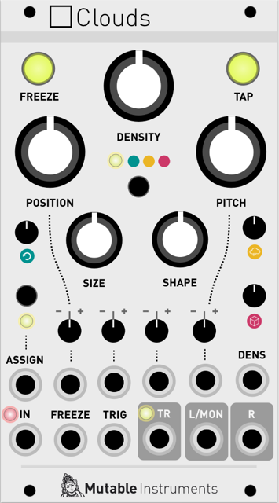 

Hannes tried sliders, but I became very stubborn with that mockup :smiley: 

That same day:

 

**June 28th 2017**

Motivated to write some code. Audio buffer and delay line classes – at the core of everything.

**July 17tht 2017**

The panel looks like this:

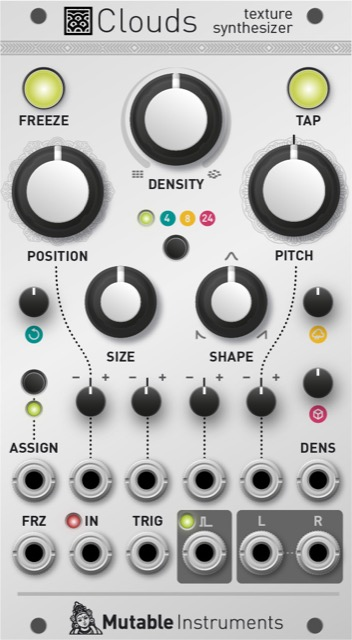 

Stray observations:
- No "solid" envelope shape
- Attenuverters
- Funny "random density" icon
- No reverse mode

**July 20th 2017**

The grain triggering code is done.

**July 21th 2017**

Frédéric Meslin (of Fred's Lab) starts working on the hardware, with an STM32F7 (216MHz, less RAM). This will last until Fall.

**October 2nd 2017**

Grain triggering code is rewritten to handle grains starting in-between samples (fractional index).

**October 3rd 2017**

Arguing about the CW DENSITY icon looking like a barcode.

**October 10th 2017**

Hardware prototypes are built.

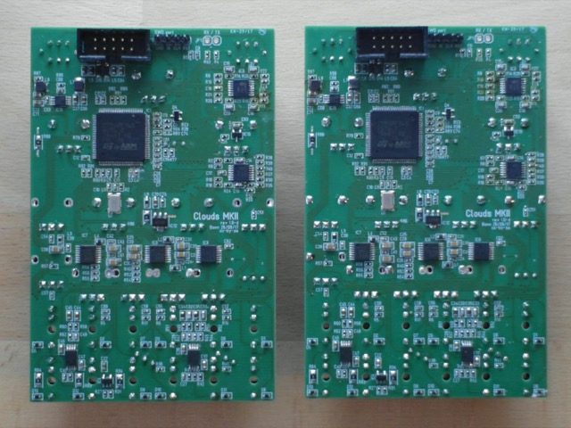 

**November 21st 2017**

New envelope shapes for the grain (including the solid one)!

**December 20th 2017**

A demo firmware (audio pass-through) runs on the hardware proto.

**January 29th 2018**

Reverb, mixing.

**February 16th 2018**

Delay mode.

**March 7th 2018**

Kaboom! I decide to cancel the F7-based project since ST has released the H7. This is pretty much the birth of Beads as you all know it.

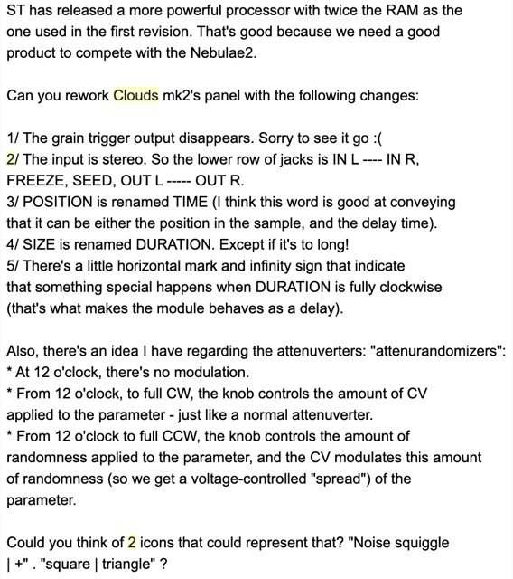 

**March 8th 2018**

Rewriting everything, absolutely everything, for stereo :'(

 

**March 9th 2018**

Still arguing about the feature set, but it starts looking familiar.

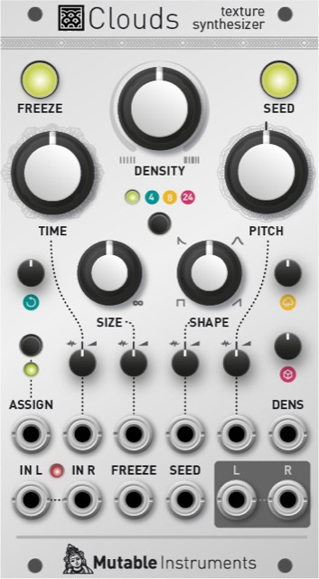 

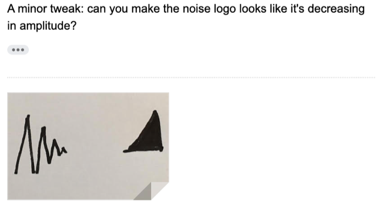 

**March 24th 2018**

Attenurandomizers are implemented.

**March 26th 2018**

Discussions about a mode in which the POSITION knob addresses slices marked by the TAP button. This never got implemented ; but some ideas ultimately got recycled in the delay feature. Interesting thing: the SHAPE knob controlled a "dubby EQ" rather than the slice/delay tap envelope.

 

**March 29th 2018**

Reversed grains are in!

 

 

**March 30th 2018**

I removed the dubby EQ because changing the slice/delay tap envelope actually sounded nice on the intro of the Talking Heads's "The Girls Want To Be With The Girls".

**April 10th 2018**

Wavetable granular synth! It's done!

**April 12th 2018**

We went full white LEDs!

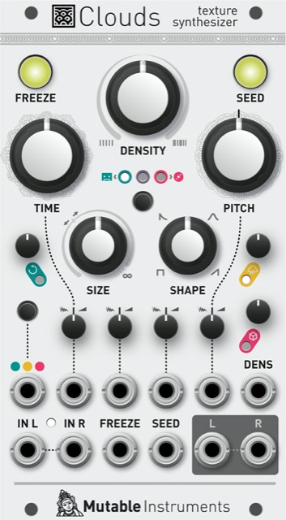 

There were still 3 quality mode LEDs, cassette to CD.

**May 7th 2018**

I post the requirements of the new version (H7, true stereo) to Frédéric. On his side, hardware development will take place in little bursts throughout the summer.

**September 7th 2018**

Now it's called Crowds.

**September 13th 2018**

Icon finalized!

**October 19th 2018**

Frédéric is working on the drivers. By the end of the year, there is a working prototype running demo oscillator code that stays in a drawer, but I have lost all motivation to work on this thing.

**September 13th 2019**

I am back in the game. Reworking Frédéric's drivers so they match the style of Marbles/Plaits/Stages/Tides.

**September 19th 2019**

Normalization detection, pot scanning, input detection and AGC.

**September 25th 2019**

Calibration, assignable CV inputs.

**September 26th 2019**

The wavetable synth mode is fully functional on the hardware.

**October 4th 2019**

Painful code change: rewrite audio buffer class to R/W in chains of non-contiguous blocks of RAM, due to H7 memory layout.

**October 8th – 12th 2019**

A productive week: test fixture, factory testing and calibration, bootloader, everything :) Huge optimization found by using a 21:10 format for delay line addresses instead of 47:16, avoiding expensive int64 to float conversion code.

 

Not happy with 3 white LEDs for the quality setting. Now I want four settings!

Looking for quality mode icons!

 

**October 11th 2019**

Meanwhile, Hannes finds the right thing to do (bars proportional to the buffer length)!

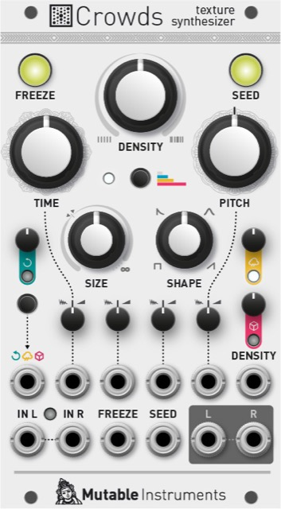 

Me being an ass:

 

 

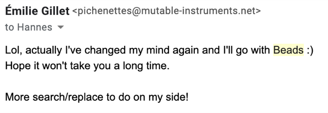 

**October 18th 2019**

Looks like we have a final panel!

 

**October 21st 2019**

The hardware is back in my hands. I update the LEDs. Unlike Frédéric, I don't build the boards myself, but have it done by Beta Layout.

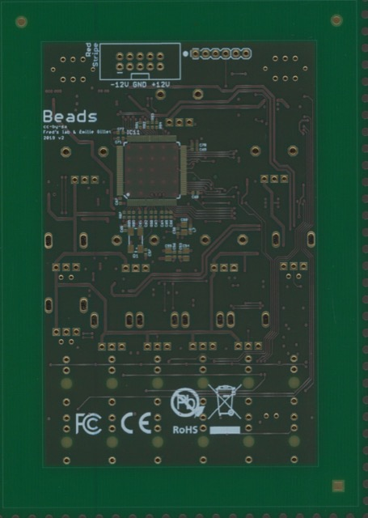 

**October 23th 2019**

"Beads needs a manual" email, with my ugly sketches:

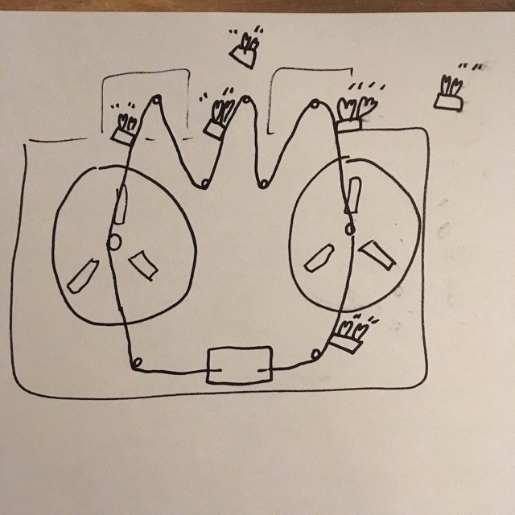 

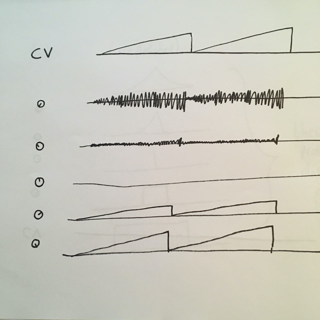 

**November 7th 2019**

Oops, New HAL from ST to support the latest revision of the H7 (480 MHz instead of 400 MHz). Lots of tricky driver code updates!

**December 4th 2019**

Beads doesn't pass FCC/CE tests.

**December 16th 2019**

Frédéric finds that the decision to split the digital and analog grounds caused a large current loop under the codec. PCB redesign starts quickly!

**December 17th 2019**

Meanwhile, buffer autosave!

**December 19th 2019**

A lot of PCB rework, new grounding scheme! Prototypes are ordered.

**January 10th 2019**

Oops, some of the prototypes don't work – weird signal integrity problems on the codec clock!

**January 17th 2019**

Frédéric is back at the EMC lab. This time, the module passes the tests, and he finds that the ferrite on the codec clock line introduced oscillations. A resistor preserves the signal integrity.

**January 27th 2020**

A new iteration of prototype boards with the final changes is ordered. Meanwhile, I'm getting ready to have my head sawed.

**February 25th 2020**

I build the last 4 prototypes. They all work as expected, the hardware is done for me!

**March 9th 2020**

Quote request sent to my CM!

**April 1st 2020**

Ordering 50+2450 units.

**July 9th 2019**

First 4 boards made, pesky problem with the factory calibration procedure (the normalization probe signal is not disabled during calibration :woman_facepalming:)

**July 30th 2020**

50 boards are made and sent to me – some sent to beta testers, some thoroughly inspected here.

**September 28th 2020**

I send my final QA report to my CM, mentioning all the issues found on the first sample of 50 boards (one unit with only large knobs, one defective LED not spotted during the factory test, and one nasty problem which turned out to be a rare software bug).

**October 5th 2020**

I give the go-ahead signal to have the rest of the boards manufactured. Most stressful email ever!

 

**November 13th 2020**

Golden firmware sent to the factory.

**February 4th 2021**

python script to allocate modules to dealers proportionally to their 2019-2020 sales.